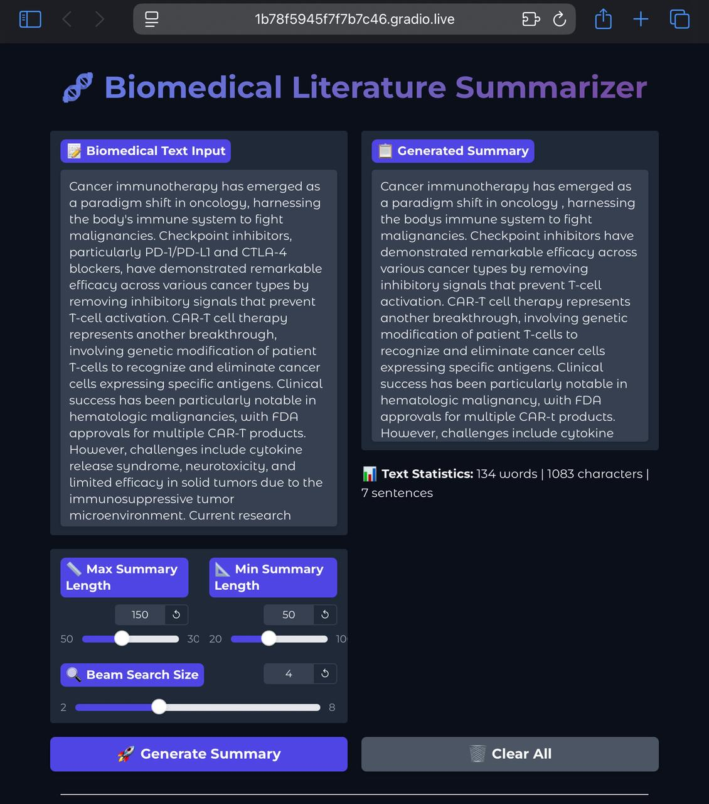

# 🧬 Domain-Specific Summarization of Biomedical Literature Using LLMs

[](https://huggingface.co/spaces/Janinduu/biomedical_summarizer)
[](https://huggingface.co/Janinduu/bart-pubmed-biomedical)
[](https://opensource.org/licenses/MIT)
[](https://www.python.org/downloads/)

An AI-powered abstractive summarization system specifically designed for biomedical research articles, leveraging fine-tuned BART (Bidirectional and Auto-Regressive Transformers) to enhance accessibility of scientific knowledge in healthcare.

<p align="center">
  
</p>

## 🎯 Project Overview

This project addresses the challenge of information overload in biomedical literature by developing a transformer-based NLP pipeline that generates concise, structured abstracts from long-form medical research articles. The solution demonstrates practical application of Large Language Models (LLMs) in healthcare contexts while showcasing responsible AI development practices.

## ✨ Key Features

- **Domain-Specific Fine-Tuning**: BART model fine-tuned on PubMed Summarization dataset
- **Interactive Web Interface**: User-friendly Gradio interface for real-time summarization
- **Adjustable Parameters**: Customizable summary length and generation quality
- **Performance Metrics**: ROUGE-based evaluation for summarization quality
- **Real-World Examples**: Pre-loaded medical examples across different specialties
- **Optimized Performance**: GPU acceleration and memory-efficient processing

## 🏗️ Architecture

Input Text → Preprocessing → BART Tokenizer → Fine-tuned BART Model → Post-processing → Summary


### Model Details
- **Base Model**: `facebook/bart-base`
- **Fine-tuning Dataset**: PubMed Summarization (10K samples)
- **Training Framework**: Hugging Face Transformers
- **Evaluation Metrics**: ROUGE-1, ROUGE-2, ROUGE-L
- **Hardware**: GPU-optimized with mixed precision training

## 🚀 Quick Start

### Online Demo
Try the live demo: [Biomedical Summarizer](https://huggingface.co/spaces/your-username/your-space-name)

### Local Installation

1. **Clone the repository**
````
git clone https://github.com/Janinduu/biomedical-literature-summarizer.git
cd biomedical-literature-summarizer
````

3. **Install dependencies**
````
pip install -r requirements.txt
````

4. **Run the Gradio interface**
````
python app.py
````

5. **Access the interface**
Open `http://localhost:7860` in your browser

## 📋 Requirements
````transformers==4.36.0
torch>=2.0.0
datasets==2.14.0
gradio>=4.0.0
evaluate==0.4.1
rouge-score==0.1.2
accelerate==0.24.0
huggingface_hub>=0.19.0
````

